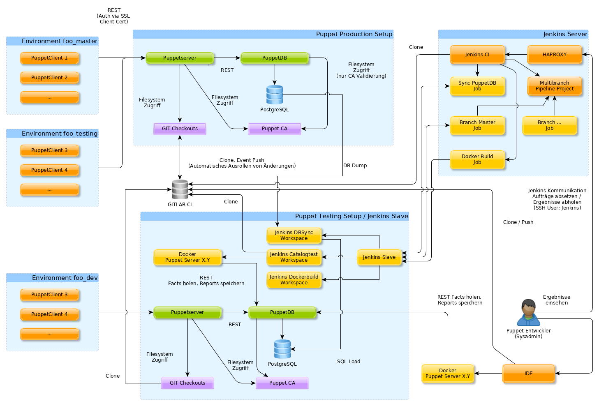

PUPPET CATALOG TESTS
====================

Kurzbeschreibung
================

Puppet berechnet auf der Basis der Servereingenschaften (Facts), dem internen und externen Puppetcode und der Konfigurationen die in den Hieradateien hinterlegt sind eine Struktur die sich "Catalog" nennt.
Dabei entsteht ein recht komplexes Netz von Abhängigkeiten bzw. eine Vielzahl von möglichen Varianten.
Das führt bei größeren Setups (wie dem unseren) dazu das bei Modul-Upgrades, Restrukturierungen bzw. auch der Aufbau von neuen Systemen immer höherer Aufwand entsteht bzw. das Setup ziemlich konservativ verwaltet werden muss. 

Das Catalog-Test-Tool ermöglicht die Auswirkungen von Änderungen testweise zu berechnen und Analysen auf den erzeugten Catalogs zu analysieren.
Auf diese Weise kann die Puppet Umgebung analysiert und die Vorgehensweise optimiert werden.

Hintergrund
===========

Größere Puppet Setups tendieren dazu zu verwildern bzw. schwer kontrollierbar zu sein, weil:

- es viele Varianten gibt und automatisierte Serverspec bzw. RSpec Tests nur grundsätzlich helfen können
   - Facts werden von Systemen intensiv genutzt<BR>
     (viele "if","then", "else" Unterscheidungen)
   - es viele unterschiedliche Setupvarianten gibt
   - es unterschiedliche Betriebssysteme gibt<BR>
     (Ubuntu 14.04, Ubuntu 16.04, ...)
- bestimmte Puppetmodule sehr intensiv in sehr vielen Systemen genutzt werden
   - die Auswirkungen von Updates sind schwer abschätzbar
   - geeignete Migrationsstratgien auszuwählen komplex und aufwändig ist
- es schwierig ist abzusehen, auf was sich ein Update alles auswirkt
- weil aufgrund konservativem Upgradeverhaltens sehr zahlreiche Deprecation- bzw. allgemeine Warnings
  auftreten und es schwierig diese effektiv im Zaum zu halten
- komplexe Netze von Abhängigkeiten Änderungen bzw. Refactorings sehr zeitaufwändig machen

Aus diesem Grund ist es sinnvoll die Kompilierung von Katalogen mit den realen Puppet-Facts
zu testen und die erzeugten Kataloge ggf. zu vergleichen bzw. zu analysieren.

Vorhandene Lösungen helfen hier nur wenig:

- https://github.com/invadersmustdie/puppet-catalog-test
- https://forge.puppet.com/puppetlabs/catalog_preview
- ... 

Diese haben folgende Nachteile:

- sie verwenden nicht die gleichen Facts und Setupkonstellationen wie die Produktionsumgebungen
- sie simulieren meist nur
   - sie erkennen meist nicht doppelte Class-Definitionen
   - sie entdecken keine zyklischen Abhängigkeiten
   - sie verwenden nicht eine definierte Puppet Version 
- man erhält keinen Dump des Katalogs um Analysen zu fahren

Charakteristik der aktuellen Lösung
===================================

Unter [doc/screenshots/Screenshots.md](doc/screenshots/Screenshots.md) finden sich Screenshots der Implementierung.

- Es werden die Puppet Facts der Produktionsumgebung genutzt<BR>
  (Hardwareaustattung, Betriebssystem, .... - auch z.B. [Exported Ressources](https://puppet.com/docs/puppet/4.10/lang_exported.html)
- Es werden die Kataloge der Systeme kompiliert
    - dedizierte Systeme
    - alle Systeme eines Environments
    - alle Environments des Systems mit allen Systemen
- Es werden Ergebnisse generiert/publiziert
    - Junit Resultfiles
        - Erfolg der Katalogberechnung
        - Ausgabe von Notices, Warnings und Errors auf Stdout bzw. Stderr
        - Compilezeit der Katalogberechnung
    - HTML Report
        - Vereinheitlichung der Meldungen (Notices, Warnings und Errors)<BR>
          => Umgebungsspezifische Details werden ersetzt damit eine Aggregation erfolgen kann
        - Aggregierte Häufigkeit der Meldung
        - Kategories der Mdelung
        - Liste der Knoten auf denen die jeweilige Meldung aufgetaucht ist
    - Extraktion der berechneten Kataloge als JSON Datei<BR>
      (kann als Basis für Analysen genutzt werden)
- Effiziente parallelisierte Ausführung<BR>
  multithreaded die >500 Kataloge unseres Systems testen (Dauer ca. 40 Minuten)
- Integration in Jenkins 

Setup und Workflow
==================

Die Skizze wurde mit dem Werkzeug [yED](http://www.yworks.com/products/yed) angefertigt.




**Der Workflow könnte wie folgt aussehen:**

1. Entwickler identifiziert/inspiziert die bestehende Umgebung über Jenkins im Rahmen neuer Entwicklungsaufgaben
   - Gibt es Hosts in den JUnit Ergebnissen die Probleme machen
   - Welche Umgebungen nutzen welche Frameworks
   - Welche Ansatzpunkte liefert der Output Report
     - Fehler
     - Warnungen
     - Informationen
     - Deprecation Warnings
     - ...
2. Die lokale Testumgebung aufbauen
   - Docker installieren
   - dafür sorgen das man netzwerktechnisch die Test PuppetDB erreicht
   - ein SSL Client Zertifikat besorgen
   - Das Puppet Meta Repo Clonen und einen Entwicklungsbranch für alle betroffenen Bereiche anlegen
   - IDE konfigurieren
   - Via MR alle Repos clonen/ausrollen
   - Dockerbuild ausführen um das Docker Image lokal nutzen zu können
3. Entwickeln
   - Docker Image als interaktive Shell starten
     (Entwicklungsverzeichnis wir als Bind-Mount in die Testumgebung integriert
   - In der IDE Änderungen vornehmen
   - Catalogests auf Ebene der betroffenen Nodes und Environments ausführen
   - Zyklisch zwischen Entwickeln und Testen Abwechseln
   - Committen und Pushen
4. Final: Ergebnisse für alle Environments abwarten und analysieren
   (dauert ca. 50 Minuten)

**Weitere Details zur aktuellen Lösung**

Beispiel Hilfe des "catalog_test_checker"
========================================

```
catalog_test_checker --help
usage: catalog_test_checker [-h] [--debug] [--problem_output]
                           [--config [CONFIG]] [--threads [THREADS]]
                           [--certname [CERTNAME]]
                           [--environment [ENVIRONMENT]]
                           (--nodesof [NODESOF] | --host [HOST [HOST ...]] | --all [ALL])
                           [--jsondir [JSONDIR]] [--junitdir [JUNITDIR]]
                           [--puppet_output_stats [PUPPET_OUTPUT_STATS]]
                           [--fail_percentage [FAIL_PERCENTAGE]]
                           [--prepare_git_repo_path [PREPARE_GIT_REPO_PATH]]
                           [--prepare_git_repo_path_src [PREPARE_GIT_REPO_PATH_SRC]]
                           [--manage_shared_env [MANAGE_SHARED_ENV]]
                           [--override_branches [OVERRIDE_BRANCHES]]
                           [--purge_existing_envs]

perform catalog compiles/tests using real puppetdb facts

optional arguments:
  -h, --help            show this help message and exit

Global options:
  --debug               Output debug information (default: False)
  --problem_output      Output problem information (default: False)
  --config [CONFIG]     configuration file 
  --threads [THREADS]   Execute the catalog tests in a defined number of
                        threads to reduce execution time (default: 1)
  --certname [CERTNAME]
                        The name of the puppet client cert which is used to
                        interact with puppetdb (default: bizbaz-
                        puppet1.nest-foo.net)

What to process:
  --environment [ENVIRONMENT]
                        The name of the environment to execute the
                        catalogtests in (default: None)
  --nodesof [NODESOF]   The name of the environment to to get the hostnames
                        from (default: None)
  --host [HOST [HOST ...]]
                        The names of one ore more hostnames (default: None)
  --all [ALL]           Execute on all known environments, add a regex to
                        filter environments (default: None)

Output/result parameters:
  --jsondir [JSONDIR]   The name of the directory to dump compiled catalogs in
                        json format (useful if you want to run statistics of
                        differential analysis) (default: None)
  --junitdir [JUNITDIR]
                        Output junit data to this directory. (useful if you
                        like to process the results in a automated way, i.e.
                        in jenkins) (default: None)
  --puppet_output_stats [PUPPET_OUTPUT_STATS]
                        Output statistics, "-" for stdout, a filename for html
                        (default: None)
  --fail_percentage [FAIL_PERCENTAGE]
                        Specifies the maximum percentage of failed hosts, on
                        which the build is considered to be broken (default:
                        20)

Environment parameters, manage git checkouts:
  --prepare_git_repo_path [PREPARE_GIT_REPO_PATH]
                        The path of the puppet environment dir where git
                        checkouts should be managed.On specification the
                        branch names are append based on the branch
                        information in puppetdb (default: None)
  --prepare_git_repo_path_src [PREPARE_GIT_REPO_PATH_SRC]
                        The path of the directory where the base repo
                        checkouts are located for the option
                        --prepare_git_repo_path,this defaults to the value
                        specified by "--prepare_git_repo_path". (default:
                        None)
  --manage_shared_env [MANAGE_SHARED_ENV]
                        Specify the name of the central shared environment,
                        appending the branch prefix will be suppressed for
                        this repo (default: None)
  --override_branches [OVERRIDE_BRANCHES]
                        Override all branches by the specified branch (useful
                        for development) (default: None)
  --purge_existing_envs
                        Purge existing branch environments (default: False)
```

Umgebung nutzen
=======================

 * Dateien für Dockerbuild vorbereiten
    * etc/id_rsa : Ein SSH Key der Zugriff auf die GIT Puppet Repos hat
    * etc/known_hosts : Ein SSH known_hosts File das den GIT Server kennt
    * etc/puppet-ssl : Ein Verzeichnis welches die SSL Zertifikate zum Zugriff auf den Testserver enthält
 * Testumgebung generieren
```
cd tools/catalog-tests
docker build -t catalogtest-puppet4-test .
```
 * In Testumgebung begeben
```
mkdir -p $PWD/work/environments
docker run -v $PWD/../../../envs:/etc/puppet/environments_src -v $PWD/work/environments:/etc/puppet/environments -v $PWD/../../../:/home/puppet/puppet/ -t -i catalogtest-puppet4-test /bin/bash
docker exec -it $(docker ps|grep "catalogtest-puppet4-test"|awk '{print $1}') /bin/bash
```
* Smoketest Zugriff PuppetDB 
```
curl \
--cacert /etc/puppetlabs/puppet/ssl/certs/ca.pem \
--cert /etc/puppetlabs/puppet/ssl/certs/bizbaz-puppet1.nest-foo.net.pem \
--key /etc/puppetlabs/puppet/ssl/private_keys/bizbaz-puppet1.nest-foo.net.pem \
'https://bizbaz-puppet1.nest-foo.net:8081/pdb/query/v4/nodes'
```
* Test für Nodes <BR>(```--manage_shared_env production``` kann man später weglassen)
```
catalog_test_checker --environment shop_master --host shop-web1.nest-foo.net --debug \
                      --prepare_git_repo_path_src /etc/puppet/environments_src  --prepare_git_repo_path /etc/puppet/environments \
                      --manage_shared_env production
catalog_test_checker --environment shop_master --host shop-web1.nest-foo.net --debug \
                      --jsondir /tmp --junitdir /tmp/ \
                      --prepare_git_repo_path /etc/puppet/environments/ --prepare_git_repo_path_src /etc/puppet/environments_src \
                      --manage_shared_env production
```
* Test für Environments <BR>(```--manage_shared_env production``` kann man später weglassen)
```
catalog_test_checker --environment shop_master --nodesof shop_master --debug \
                      --jsondir /tmp --junitdir /tmp/ --threads 20 \
                      --prepare_git_repo_path /etc/puppet/environments/\
                      --prepare_git_repo_path_src /etc/puppet/environments_src \
                      --manage_shared_env production
catalog_test_checker --all "shop" --debug --jsondir /tmp --junitdir /tmp/ --threads 20 \
                      --prepare_git_repo_path /etc/puppet/environments/ --prepare_git_repo_path_src /etc/puppet/environments_src \
                      --manage_shared_env production
```
* Entwicklung
  * Status quo erfassen
    ```
    mkdir -p /tmp/status_quo /tmp/status_new
    catalog_test_checker --environment shop --host shop-lb2.nest-foo.net --debug --jsondir /tmp/status_quo
    ```
  * Änderungen durchführen
    ```
    vim env/shop/hieradata/common.yaml 
    cd env/production/
    # Modul aktualisieren
    vim Puppetfile
    r10k puppetfile install
    ```
  * Neuen Status erfassen
    ```
    catalog_test_checker --environment shop --host shop-lb2.nest-foo.net --debug --jsondir /tmp/status_new
    ```
  * Änderung diffen
    ```
    vim -d /tmp/status_new/shop_shop-lb2.nest-foo.net.json /tmp/status_quo/shop_shop-lb2.nest-foo.net.json 
    json_diff --fast -u /tmp/status_new/shop_shop-lb2.nest-foo.net.json /tmp/status_quo/shop_shop-lb2.nest-foo.net.json
    ```

Nosetests / Unittests für das Catalog Test Runner Werkzeug
=========================================================

 * In den Dockercontainer begeben
 * Tests ausführen
   ```
   cd ./puppet-catalog-check
   nosetests3 -s
   ```

Lizenz und Beteiligte
=====================

Diese Software wurde von Marc Schöchlin entwickelt und unterliegt der [GPLv2 Lizenz](./LICENCE)
Initial wurde die Software (im Jahre 2016) als Freizeitprojekt entwickelt und später auch im beruflichen Umfeld weiterentwickelt.
Wie es die GPLv2 Lizenz vorsieht, kann diese Software ohne Einschränkung von meinen ehemaligen Arbeitgebern weiterentwickelt und weitergenutzt werden.
