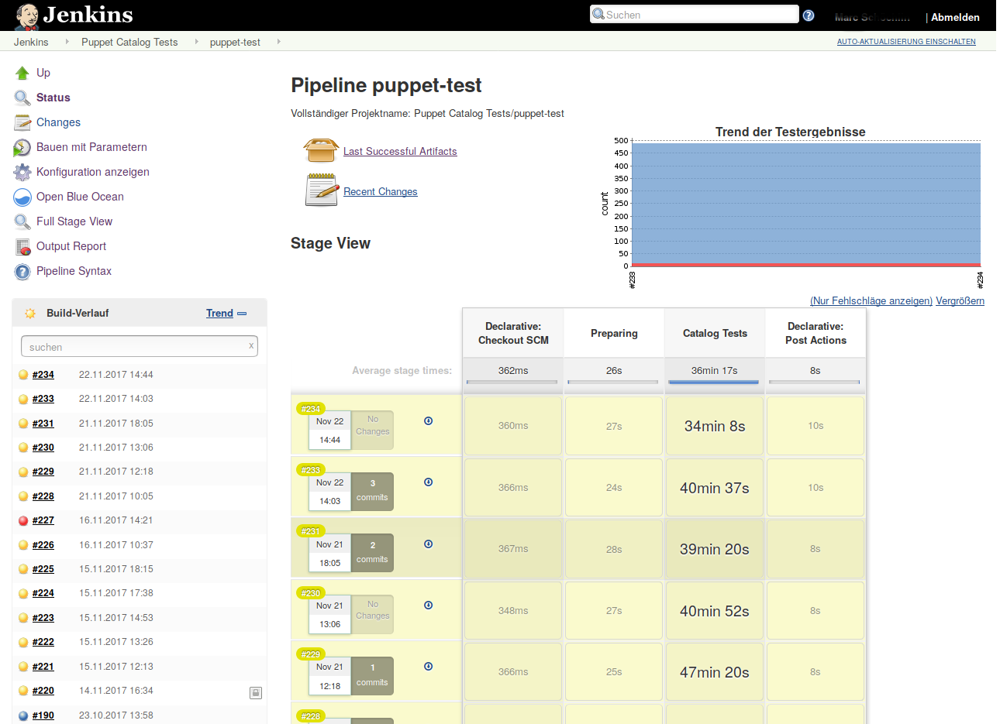
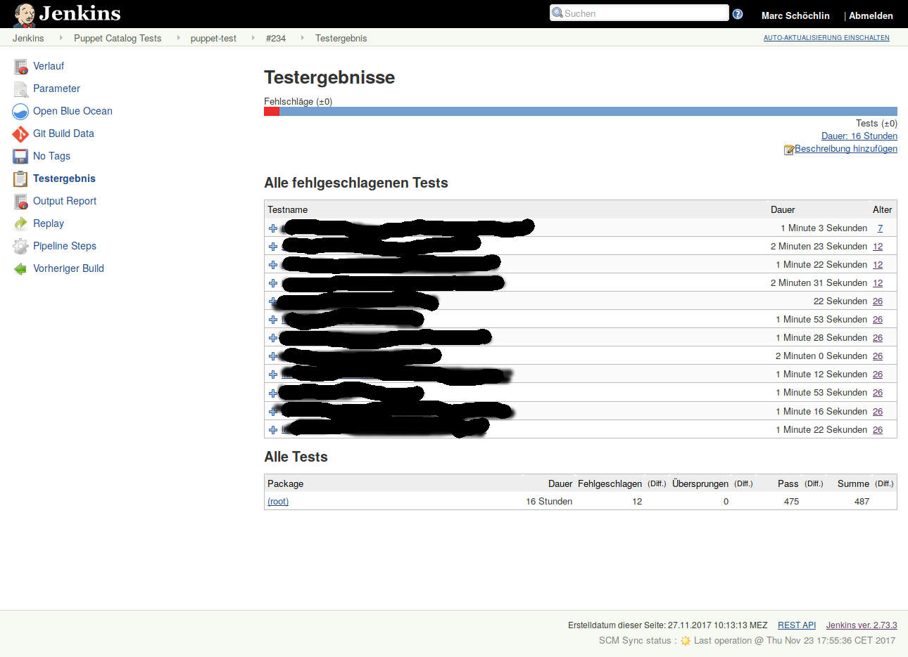
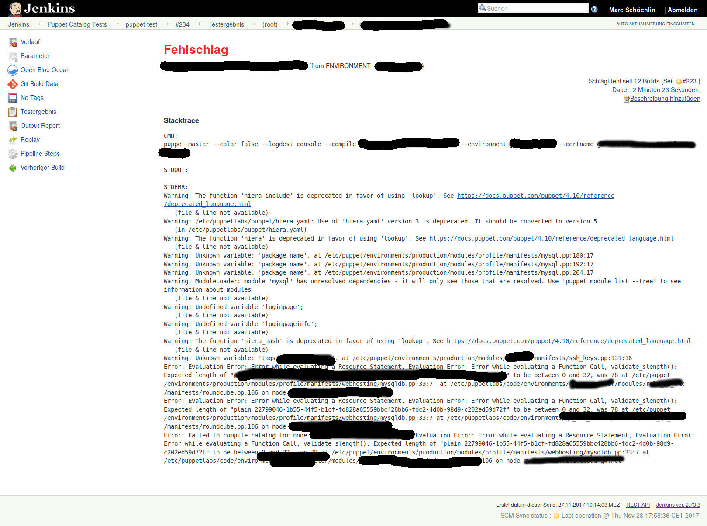
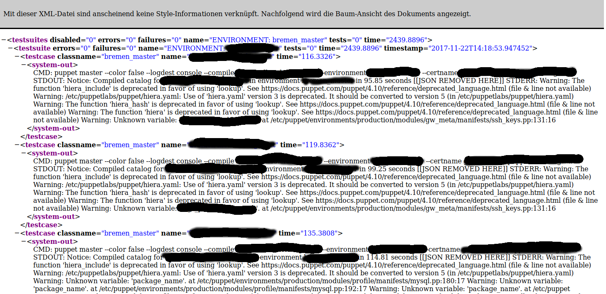
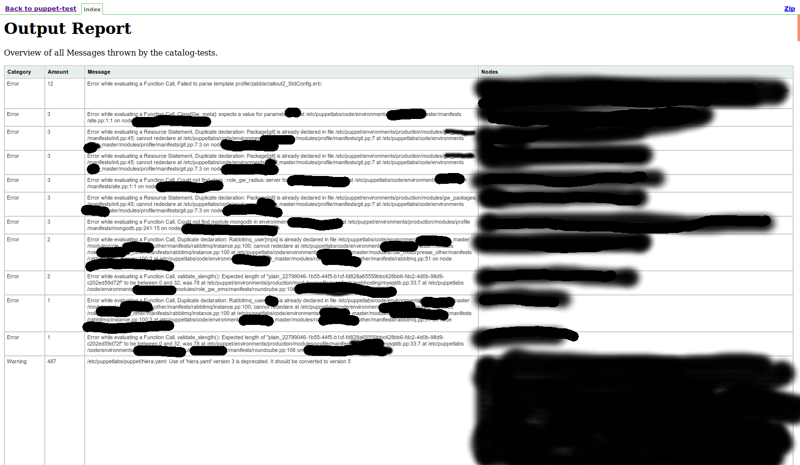
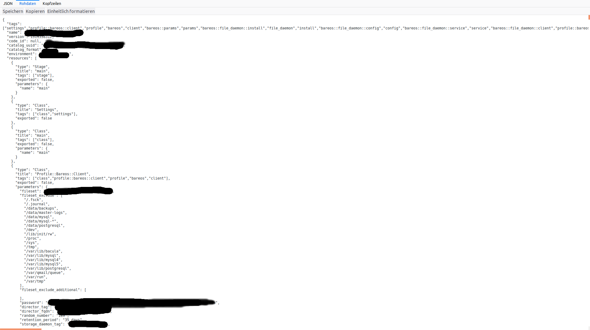

Jenkins Infrastruktur
=====================

* Anzeige der letzten Compile Vorgänge
* Anzeige des Trends bei Compilefehlern

 

* Anzeige der fehlgeschlagenen Hosts nebst deren Environments
* Browsing der erfolgreichen und fehlgeschlagenen Hosts
* Aufruf der Detailergebnisse bzw Compilezeiten

 

* Anzeige der Details bei der Kompilierung des Katalogs
* Fehler, Warnungen und Benachrichtigungen

* XML Output im JUnit Format
* Automatisiert lesbares Format z.B. für Jenkins

Output Report
=============

* Anzeige der verschiedenen Meldungen als HTML Tabelle 
* Die Meldungen werden nach Kategorie, Anzahl, Messagetext gruppiert darstellen
  (Individuelle Aspekte wie z.B. Hostnamen in den Meldungen, werden vereinheitlicht)
* Auflisten von Hosts die die genannte Meldung protokolliert haben
* Sortierung nach verschiedenen Aspekten

JSON Output
===========

* Erzeugter Karalog als JSON Repräsentation
* Einheitliche Sortierung der Elemente für vereinfachtes Vergleichen

